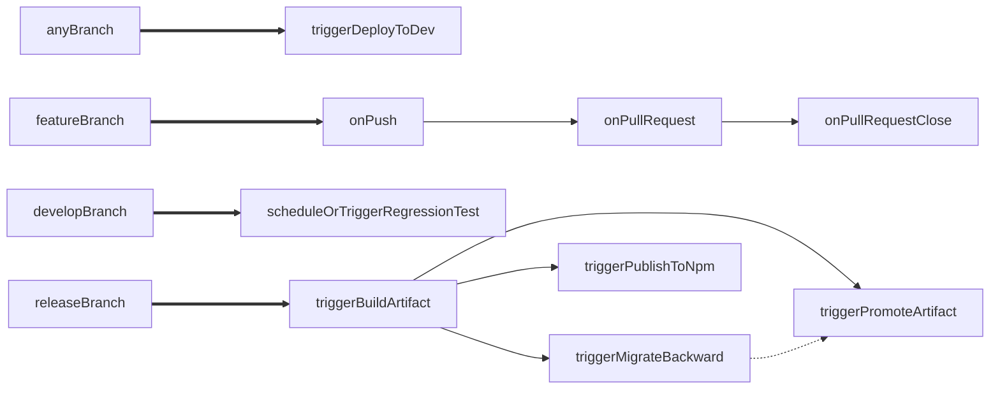
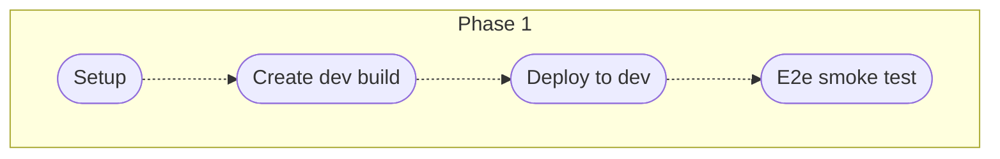
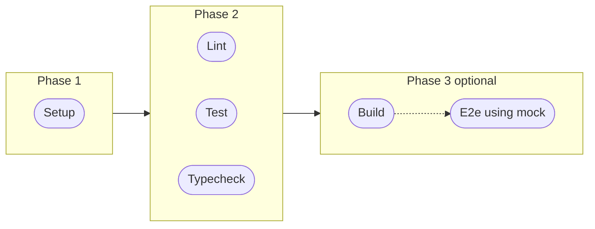
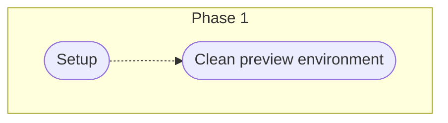
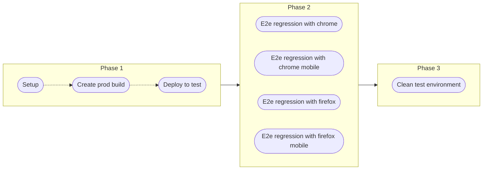
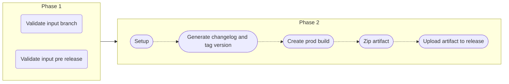
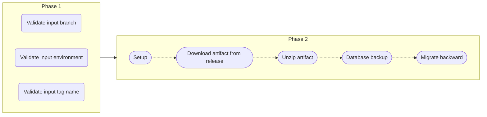
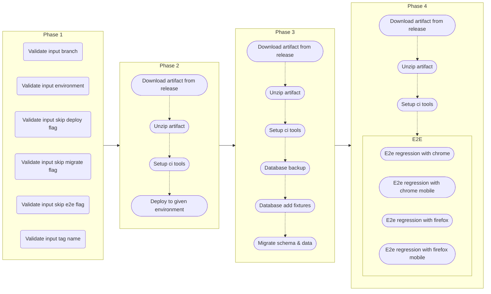
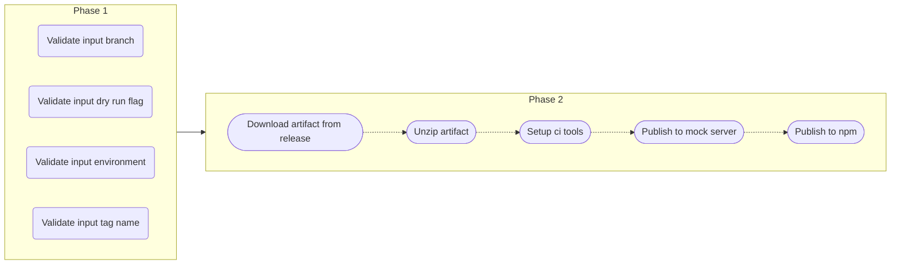

# Pipeline

## Any branch

### triggerDeployToDev

## Feature / fix branch

### onPush

- Phase1 and Phase 2: on every branch
- Phase3 (optional): maybe on release/main

### onPullRequest

### onPullRequestClose

## Develop branch

### scheduleOrTriggerRegressionTest

## Release branch

### triggerBuildArtifact

### triggerMigrateBackward

### triggerPromoteArtifact

### triggerPublishToNpm

