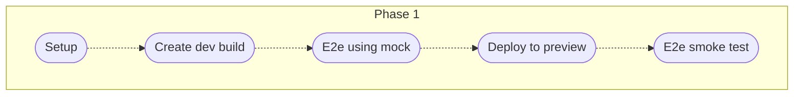

# Environment

**Development**

- localhost: to develop on. Test in isolation with mock.
- preview(temporary): reviewer to test on
- test(temporary): automated testing of production build

**Artifact testing**

- dev: developer test against technical specification
- sit: architect test against technical design
- sys: business analyst against solution requirement
- uat: user/stakeholders test against business scenarios
- prod: `[requires approval]`

* other: security and load testing

[Reference](https://www.linkedin.com/pulse/unit-sit-system-uat-pvt-one-same-mae-gajo)

# Pipeline


## Any branch

### triggerDeployToDev

- Only when you need to work on a real environment.
- Create a development build
- Bypass any test. Just a smoke test after deployed
- all in 1 phase, to speed up deployment


## Feature / fix branch

### onPush

- Phase1 and Phase 2: on every branch
- E2e to only run on release/main


### onPullRequest



### onPullRequestClose


## Develop branch

### scheduleOrTriggerRegressionTest


### scheduleOrTriggerSecurityCheck

- the github ones does not seems to require any setup


## Release branch

### triggerBuildArtifact


### triggerPublishToNpm


### triggerPromoteArtifact

- limitation: cannot select/filter a release tag from the UI. So we have to select a base branch and select a release tag
- limitation: UI does not support dropdown input for enum. Validation is needed on input
- validation on input branch is needed as the branch affect the pipeline


### triggerRollbackArtifact

- needs more investigation
- e2e test are stored in the artifact, so that only relevant test are run when rolling back
- selected branch must be at least last release branch to have the backward migration code


# Automatic versioning with conventional commits

- Create changelogs
  - chore are ignore in the changelog. Aim for changes code that does not trigger a production code change
  - docs, feat, fix, etc... are added to changelog
  - Ideal when BA decides on the wording, so that the changelog can be targeted at the end user
  - Squash commit recommended
    - to ensure changelog does not capture any WIP commit by accident.
    - also makes cherry picking easier
    - and git bisect as well to prevent false positive
- Semantic release or lerna version for monorepo
  - fix: will do a patch verion bump
  - feat: will do a minor version bump
  - breaking: will do a major version bump
- Changelog can be uploaded to the release tag as well

# Release process

- Create a release branch
- Create an pre release artifact and promote up to uat. Appends alpha/beta to the release
- Then graduate the release and promote from dev to prod. Removes any preId in the version name
- Once an artifact has been created, fixes/hotfixes can be continually applied to the release branch without affecting the artifact
- Displaying the version number in the UI helps identify issue when different environment has different version
- this setup supports maintaining multiple version releases

# Caching

- Yarn/npm/cypress uses cache very effectivly. They do install in seconds if they have all the cache
- Take advantage on this, so that our pipeline cache the `cache`. So npm/yarn only have to download additional package required
- requires: fallback cache key to be effective
- If `node_modules` were cached, on every new package, all the dependencies needs to be redownloaded

```yml
# Github workflow
- name: Cache npm cache on linux
  uses: actions/cache@v2
  with:
    path: ~/.npm
    key: ${{ runner.os }}-setup-${{ hashFiles('**/package-lock.json') }}
    restore-keys: ${{ runner.os }}-setup-

- name: Cache cypress cache on linux
  uses: actions/cache@v2
  with:
    path: ~/.cache
    key: ${{ runner.os }}-cypress-${{ hashFiles('**/package-lock.json') }}
    restore-keys: ${{ runner.os }}-cypress-
```

# Security / Quality check

- 42Crunch API
- CodeScan
- CxSAST
- Codacy Security Scan
- DefenseCode ThunderScan
- DevSkim
- Fortify on Demand Scan
- Kubesec
- Mayhem for API
- njsscan
- OSSAR
- Prisma Cloud IaC Scan
- Scan
- Semgrep
- Snyk Infrastructure as Code
- Synopsys Intelligent Security Scan Action
- Veracode Static Analysis
- Xanitizer

# Renovate

- automatic PR with dependency upgrade.
- PR provides change log
- When used together with Testing/Linting/Typechecking/Previewing. Repo can be updated easily

# Improvement

- Performance test in pipeline
- Visual regression test in with cypress
- Accessibility test with cypress
- Lighthouse test in pipeline
- Playground in preview: to allow reviewing to try different scenarios for components
- Canary releases
- Add Maintenance mode in pipeline
- Deployment strategies in pipeline
  - **Recreate**: Version A is terminated then version B is rolled out.
  - **Ramped** (also known as rolling-update or incremental): Version B is slowly rolled out and replacing version A.
  - **Blue/Green**: Version B is released alongside version A, then the traffic is switched to version B.
  - **Canary**: Version B is released to a subset of users, then proceed to a full rollout.
  - **A/B testing**: Version B is released to a subset of users under specific condition.
  - **Shadow**: Version B receives real-world traffic alongside version A and doesn’t impact the response.
- automating branch creation from ticket, and moving the ticket across the board as it goes to different environment. commit message needs to end with one of these below to track:
  - fix #xxx
  - fixes #xxx
  - fixed #xxx
  - close #xxx
  - closes #xxx
  - closed #xxx
  - resolve #xxx
  - resolves #xxx
  - resolved #xxx
